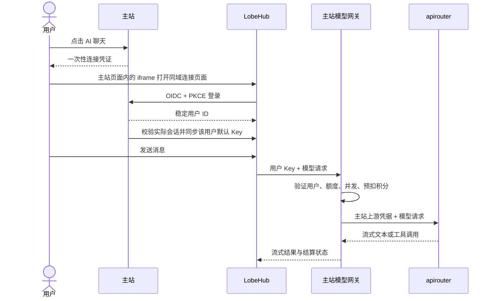

# 主站接入已部署的 LobeHub

适用本次测试环境：主站 `https://test-flowlight.tcmzhan.com`，LobeHub `https://test-lobehub.tcmzhan.com`，apirouter 为主站已经配置的 Relay。这里接入现有 LobeHub，不重建其数据库、对象存储或加密密钥。

本目录的开发工作不会自动修改线上配置。部署顺序为 **apirouter → 主站 → LobeHub 环境变量 → 两个站点的 Nginx 配置**。完成后，用户从主站侧栏「AI 聊天」进入，无需手动复制 Key。

已核实的香港测试服务器可以直接使用 [一键启用脚本](CURRENT-SERVER.md#推荐一键启用)，无需逐项手动编辑下面的配置。脚本只适用于该测试环境的现有目录和服务名称。

## 接入后的链路



- 主站用户 ID 是 OIDC `sub`，数据库保存唯一的主站用户 ↔ LobeHub 用户映射。
- 连接凭证只能使用一次，10 分钟过期；授权码 2 分钟过期，需要 PKCE S256 和客户端密钥。
- 原始用户 Key 由主站后端通过 LobeHub 本机接口写入用户自己的加密 provider 配置。连接 URL、桥接页面和绑定响应都不包含原始 Key。
- 同一主站用户的配置同步使用数据库租约串行执行；多个标签页或多个主站实例同时连接时，后来的请求返回 `SYNC_IN_PROGRESS`，不会让旧同步覆盖刚轮换的 Key。异常中断的同步锁最多 3 分钟自动过期。
- LobeHub 侧通过 `FEATURE_FLAGS` 关掉在本网关下无法工作的功能：AI 生成图片、知识库/资源、语音输入、社区（助理市场）、检查更新、更新日志、首页推荐，以及 provider 设置与 OpenAI Key/代理表单（BYOK 已由绑定流程关闭，再留着表单等于引导用户做无效配置）。无法关闭的部分：搜索、首页、助理、记忆没有对应开关；「隐藏 GitHub/文档」属于 LobeHub 的商业授权开关，未使用。升级后若某个开关被改名，LobeHub 的解析器会忽略它，表现为该入口重新出现，不会导致部署失败。
- provider 名称为「流光主站」，ID 为 `flowinglight`。每次连接会把其他 provider 全部停用，模型选择器里只留主站模型——LobeHub 自带的 Anthropic、Google 等 provider 默认开着但没有 Key，其模型点了必然失败，也不走主站网关。provider 列表在运行时读取而非写死，随 LobeHub 升级自动适配；个别被官方保护、拒绝停用的 provider 会跳过并记录日志，不影响本次连接。现有聊天记录不受影响。
- 开放模型来自主站后台已启用的文本模型。模型列表展示「模型名称 · 输入/输出 积分/1M Token」，首次绑定设置默认聊天模型和默认助手。
- 本次按 LobeHub v2.2.16 的官方源码接口对接，并对测试服务器当前运行镜像的 provider、模型、用户设置、默认助手接口做了实际验证。升级 LobeHub 后应先在测试环境验证这些接口。

## 1. 发布代码

本次涉及两个仓库，必须一起发布相关改动：

| 仓库 | 改动 |
|---|---|
| `tide-canvas` | OIDC、账号桥接、模型网关、积分记录、主站入口 |
| `apirouter` | Chat Completions 工具参数/结果透传、Responses 转换、异常流结束判断 |

apirouter 中修改 `ChatService.java`、`V1ChatController.java`，新增 `ChatProtocol.java` 及相应测试。附带的 `apirouter-compat.patch` 基于 apirouter 提交 `65ecc41142047491ab196a39a54519984a8961f4`，已通过 `git apply --check`；如果部署来源已经包含这些代码，不要再应用补丁。独立应用前在 apirouter 根目录运行：

```bash
git apply --check /path/to/apirouter-compat.patch
git apply /path/to/apirouter-compat.patch
```

用原有发布流程更新 apirouter、主站后端和前端。主站首次启动会迁移 `lobehub_grant`、`lobehub_link`、`model_gateway_request` 三张新表；原用户和默认 Key 不变。先备份数据库，再按正常发布流程执行迁移。

只部署主站时，保持 `TIDECANVAS_LOBEHUB_SUPPORTSTOOLS=false`，可先接通普通聊天。部署兼容版 apirouter 并确认上游模型支持工具后，再设为 `true`；仅打开开关不能补足上游的工具能力。

## 2. 生成接入密钥和主站配置

将本目录上传到服务器 `/root/lobehub-integration`。Debian 的 Python 依赖可以使用：

```bash
apt-get update
apt-get install -y python3-cryptography
cd /root/lobehub-integration
python3 prepare.py init --supports-tools
```

如果 apirouter 尚未升级，去掉 `--supports-tools`。生成文件全部放在已忽略的 `private/` 中，脚本不打印密钥；重复运行保留已有客户端密钥和 RSA 私钥。生成后自己调整过的 `main.env` 配置会被重新写入默认值，日常部署无需反复运行 `init`。

生成内容：

| 文件 | 用途 |
|---|---|
| `private/client-secret` | OIDC 客户端密钥备份 |
| `private/oidc-private.pem` | 主站 OIDC 签名私钥，必须持久保存 |
| `private/main.env` | 主站后端环境变量 |
| `private/lobehub.env` | 合并进现有 LobeHub 的配置片段 |

`main.override.yml` 为本项目 `deploy/docker-compose.yml` 提供后端 `env_file` 和私钥只读挂载。使用**原有 Compose 项目名、原有主配置文件路径和原有 .env**启动，不要另起一个主站项目。下例的目录应替换成你现有主站部署目录：

```bash
cd /path/to/existing/tidecanvas-deploy
docker compose -f docker-compose.yml -f /root/lobehub-integration/main.override.yml pull
docker compose -f docker-compose.yml -f /root/lobehub-integration/main.override.yml up -d backend frontend
```

以后更新主站时也要保留这个 override，否则会丢失环境变量/私钥挂载。不要运行 `docker compose config` 并把输出贴到公共位置，它可能展开密钥。

当前方案要求主站后端使用 host 网络、LobeHub 映射 `127.0.0.1:3210`。如果你的部署不同，将 `TIDECANVAS_LOBEHUB_INTERNALURL` 改成**主站后端可直达的 LobeHub 内部地址**，不要指向带鉴权子请求的公网反代，以免绑定时发生递归拦截。

检查主站已启用：

```bash
curl -fsS https://test-flowlight.tcmzhan.com/api/lobehub/config
curl -fsS https://test-flowlight.tcmzhan.com/api/lobehub/oidc/.well-known/openid-configuration
curl -fsS https://test-flowlight.tcmzhan.com/api/lobehub/oidc/jwks
```

第一个接口应返回 `enabled: true`。如果为 false，查看主站日志中的 `LobeHub integration is not ready`，检查私钥路径、URL 和客户端密钥。

## 3. 合并 LobeHub 环境变量

先确认现有 LobeHub Compose 工作目录和 `.env` 所在位置。将配置片段合并进去，**不要用片段覆盖整个原文件**：

```bash
python3 /root/lobehub-integration/prepare.py merge-env \
  --target /path/to/existing/lobehub/.env \
  --fragment /root/lobehub-integration/private/lobehub.env
```

脚本自动备份原 `.env`，只替换片段列出的键。保留原 `AUTH_SECRET`、`KEY_VAULTS_SECRET`、`JWKS`、数据库和 S3 配置，这些密钥决定旧账号会话和加密数据能否继续使用。

确认 LobeHub 的 Compose 服务确实通过 `env_file: .env` 或 `environment` 接收下面这些变量。**仅把变量写进用于 Compose 插值的 `.env`，容器不会自动获得它们。**如果当前没有透传，可在现有 `lobehub` 服务下补充：

```yaml
environment:
  AUTH_SSO_PROVIDERS: ${AUTH_SSO_PROVIDERS}
  AUTH_GENERIC_OIDC_ID: ${AUTH_GENERIC_OIDC_ID}
  AUTH_GENERIC_OIDC_SECRET: ${AUTH_GENERIC_OIDC_SECRET}
  AUTH_GENERIC_OIDC_ISSUER: ${AUTH_GENERIC_OIDC_ISSUER}
  AUTH_DISABLE_EMAIL_PASSWORD: ${AUTH_DISABLE_EMAIL_PASSWORD}
  AUTH_ALLOWED_EMAILS: ${AUTH_ALLOWED_EMAILS}
  AUTH_EMAIL_VERIFICATION: ${AUTH_EMAIL_VERIFICATION}
```

随后在现有 LobeHub 目录重新创建该服务，服务名如果不是 `lobehub`，使用实际名称：

```bash
docker compose up -d --force-recreate lobehub
```

无需重启或重建 PostgreSQL、RustFS、SearXNG。保持 `APP_URL=https://test-lobehub.tcmzhan.com`。不要给全部用户配置共享的 `OPENAI_API_KEY`；每个人的主站 Key 由桥接自动写入。

OIDC 回调地址固定允许以下两种版本，不能填写通配符：

- `https://test-lobehub.tcmzhan.com/api/auth/oauth2/callback/generic-oidc`
- `https://test-lobehub.tcmzhan.com/api/auth/callback/generic-oidc`

## 4. 合并 Nginx 路由

在主站的 HTTPS `server` 块引入 `nginx-main-locations.conf`，在 LobeHub 的 HTTPS `server` 块引入 `nginx-lobehub-locations.conf`。可复制文件到 `/etc/nginx/snippets/` 后使用绝对路径 `include`。

保留已有证书、S3 路由、根路径代理和静态资源配置；如果已有相同 `location`，合并内容，不要重复声明。检查更早的正则路由及 `^~ /api/`、`^~ /trpc/` 等规则，避免它们绕过本次鉴权规则。LobeHub 本机 3210 端口不要向公网暴露。

两份片段提供：

- `/flowinglight/connect` 和 `/flowinglight/bind`：LobeHub 同域桥接至主站后端，浏览器正常携带 LobeHub 会话 Cookie。
- OIDC 路径关闭访问日志，避免把授权码等短期凭证写入 Nginx access log。
- 代理显式覆盖客户端 IP 转发头，避免把登录/绑定用户全部统计为 `127.0.0.1`，也不使用请求方伪造的转发链。若前面另有 CDN，应先按该 CDN 的可信地址配置 Nginx real_ip。
- `/api/auth/*` 保留直连 LobeHub，不经过会话子请求。
- LobeHub 的 `/api/*`、`/trpc/*`、`/webapi/*` 业务接口使用 `auth_request` 重新校验主站账号；账号停用后，已有 LobeHub 会话的受保护接口也被拒绝。
- 模型网关保持 SSE 不缓冲，长连接允许 60 分钟；底层模型提供方仍可能有更短的超时。

检查并加载：

```bash
nginx -t
systemctl reload nginx
```

本目录两份片段已用测试服务器的 Nginx 执行独立语法检查，但仍需对你合并后的**完整配置**执行 `nginx -t`。

## 5. 用户使用与计费

用户登录主站 → 侧栏「AI 聊天」→「进入 AI 聊天」，聊天在**主站页面内嵌的 iframe** 里打开，不再跳出到聊天域名。首次进入创建/映射个人 LobeHub 账号、同步模型和默认 Key；后续进入刷新 Key 与开放模型配置。

嵌入依赖两个前提，改域名前先确认：

- 聊天域名与主站域名属于**同一个可注册域**（当前 `test-lobehub.tcmzhan.com` 与 `test-flowlight.tcmzhan.com` 同为 `tcmzhan.com`）。若换成不同注册域，iframe 变成第三方上下文，浏览器会拦截 LobeHub 的会话 Cookie，嵌入将无法登录。
- LobeHub 自身不下发 `X-Frame-Options` / CSP `frame-ancestors`（当前镜像已确认）。桥接页由主站显式允许主站域名作为唯一父页面。

嵌入被浏览器拒绝时，工具条上的「在新标签页打开」仍可用；LobeHub 把丢失的会话弹回主站 `/ai-chat` 时，页面会自动跳出 iframe 回到入口，不会自我嵌套。

| 项目 | 实际规则 |
|---|---|
| 模型来源 | 后台「AI 聊天供应商」：主站持有第三方 OpenAI 兼容服务的地址与密钥，直连它们。一个供应商可配多组 `base_url + api_key`，调用时按顺序尝试，前一组连不上自动换下一组；已经开始返回内容后不再切换（否则会重复文字并重复计费） |
| 模型发现 | 供应商详情点「从供应商拉取模型」，主站请求其 `GET /v1/models`。拉到的模型默认**未开放、未定价**，填好每百万 Token 单价后才能开放 |
| 与创作台的关系 | 完全分开。这些配置存在 `chat_provider / chat_endpoint / chat_model` 三张表，创作台生成与「模型管理」既不读也不受影响 |
| 凭证安全 | 第三方密钥加密存库、后台只显示是否已设置、从不下发前端；上游若在报错里回显密钥，网关会用自己的文案整体替换后再返回 |
| 计费方式 | 由**模型自身配置**决定：打开 Token 计费的模型按上游实际返回的 Token 用量结算，非缓存输入 × 输入单价 ÷ 1,000,000 ＋ 缓存输入 × 缓存单价 ÷ 1,000,000 ＋ 输出 × 输出单价 ÷ 1,000,000，向上取整到 0.000001 积分 |
| 单价配置 | **逐个模型**在「AI 聊天供应商 → 该模型」一行里填输入/输出每百万 Token 积分与 Token 上限 |
| 未配置单价 | 该模型不出现在 LobeHub 模型列表，也无法调用——AI 聊天没有按次计费，没有单价就无法收费 |
| 改价生效 | 计费立即按新单价执行；但模型选择器里的价格标签存在 LobeHub 自己的库里，只在每次连接时推送，所以改价后要在聊天工具条点「同步模型价格」（或退出重进）才会刷新 |
| 单价填错 | 该模型同样被撤下并拒绝调用；供应商页面在这一行标出「单价配置无效」 |
| 预留与释放 | 发起上游请求前按「输入上限 × 输入单价 ＋ 输出上限 × 输出单价」预留积分，结算时释放预留、只扣真实用量。预留期间这部分积分不能被其他功能或订单退款收回 |
| 用量缺失 | 上游未返回可信 usage 时不估算收费：账单置为 `billing_pending`，预留继续保留，等后台在「积分管理 → Token 调用账单」按上游日志核对结算或释放 |
| 重复模型标识 | 同一 `model_key` 存在多条启用记录时，列表、绑定和扣费统一按排序值升序、更新时间降序、ID 升序选择同一条记录 |
| 扣费时机 | 发起上游请求前，事务内校验余额并预留；余额不足不请求上游 |
| 失败 | 上游已报告消耗的输入 Token 照常计费；完全没有用量也没有输出时释放全部预留 |
| 请求校验 | 网关只拒绝两种请求：不是单个 JSON 对象的，以及模型未开放给 AI 聊天的。消息、工具、`n`、温度等一律原样转给上游，由上游判断；输出上限（`max_tokens` / `max_completion_tokens`）超过该模型定价上限时收窄到定价上限而不是拒绝，因为预留积分按它计算。请求体上限 64 MiB 是防滥用，不是产品限制 |
| 上游报错 | 上游拒绝时，把上游自己的错误原文、HTTP 状态透传给用户（SSE 里在最后一帧的 `error.message` 与 `upstream_status`，非流式沿用上游状态码）；只做一件处理：把接入地址的 API Key 替换为 `[REDACTED]`。计费结果在独立字段，不混进文案 |
| 备用地址切换 | 只在问题出在该地址时换下一组：连接失败、401/403/429、5xx。400/404/413/422 等是请求本身的问题，每一组地址都会同样拒绝，因此立即透传，不重试，也不记入该地址的健康状态 |
| 上游异常连接 | 收到明确错误后立即结束并结算，不等待上游主动断开；无效 JSON 事件按中断处理，不转发给页面 |
| 部分结果 | SSE 保留最后一帧中的内容并发送错误；非流式 HTTP 502 的 `partial_response` 字段提供已生成内容，相同请求标识可重放，不重复扣费 |
| 辅助请求 | 工具循环的每次模型调用、翻译、改写等均独立计费；不是一个可见提问永远只收一次 |
| 账单查询 | 用户在「AI 聊天」页查看自己的 Token 账单；管理员在 `/admin/points/token-billing` 查看全部账单并处理待核对项，处理动作写入业务审计日志 |
| 默认辅助设置 | 首次绑定关闭自动标题、推荐、压缩等后台调用，保留主动翻译和改写；用户后续可以自行调整 |
| 每日调用上限 | `TIDECANVAS_LOBEHUB_DAILYLIMIT`，按上海时区，默认 0 不限，统计 pending/success/partial/billing_pending；已释放和未扣费的失败调用不计入 |
| 账户累计上限 | 主站后台用户「API 累计调用额度」，0 不限，正数限制本集成网关累计的 pending/success/partial/billing_pending 次数 |
| 并发 | `TIDECANVAS_LOBEHUB_MAXCONCURRENT`，默认 2；沿用账户并发不限标志 |
| 接口频率 | 每个主站用户、每个网关路由每分钟最多 120 次，超出返回 HTTP 429；不会把所有 LobeHub 用户按同一个出口 IP 合并限流 |
| 历史上下文 | 由 LobeHub 决定（助手设置里的「历史消息数」与历史压缩）；网关原样转发，不再裁剪 |
| 幂等重放 | 相同用户提供相同 `Idempotency-Key` 且内容一致时只扣一次；进行中返回 409，完成后可重放。相同键搭配不同内容返回 409 |
| 普通重发 | 未复用请求标识的重新发送、继续提问是新调用，按其自身 Token 用量计费。LobeHub 自身的「重新生成」不承诺免费 |
| 关闭页面 | 已开始的上游调用继续结算；页面断开不代表立即取消。主站崩溃留下的预扣，过期后由后台补偿退款 |
| 补偿异常记录 | 补偿任务按 ID 分页并循环重试，单条退款异常不会阻断后续用户；账号已删除或退款凭证冲突的记录保留并记录日志，供管理员核对 |
| 重置 Key | 主站立即拒绝旧 Key；从主站再次进入 LobeHub，同步最新 Key |
| 账号停用 | 网关即时拒绝，LobeHub 受保护业务接口也通过 Nginx 校验主站状态 |

后台模型调用日志和积分流水会记录归属的主站用户。网关不会复制主站共享上游密钥给 LobeHub，也不会为用户创建 apirouter 后台账号。

工具返回图片/文件时，apirouter 保留 `tool_call_id`、图片精度及文件标识，Responses 通路将它们转换成结构化内容数组，不把整个结果变成 Java 字符串。该形式对应 [OpenAI 官方 SDK 的 FunctionCallOutput 定义](https://github.com/openai/openai-python/blob/main/src/openai/types/responses/response_input_param.py)；具体模型仍需支持所使用的模态。

计费和限额只覆盖 `flowinglight` 的主站网关。**用户自带 Key（BYOK）已被关闭**：每次连接都会停用其他 provider，用户即使手动开启，下次进入也会被再次停用。若日后要放开，去掉绑定流程里的 `hideForeignProviders` 调用即可；那些调用不消耗主站积分。语音、绘图等专用协议接口不由本次文本模型网关提供，需在 LobeHub 配置相应服务；图片输入见下节「聊天里的附件上传」。

## 聊天里的附件上传

默认**不开放**：`prepare.py` 的 `FEATURE_FLAGS` 关掉 `knowledge_base`，LobeHub 的附件按钮
（`ChatInput/ActionBar/Upload`）在该标志为假时整个不渲染。这是有意的——上传链路依赖
LobeHub 自己的对象存储，与主站网关无关，网关只转发消息。

要开放，需要同时满足四项，缺一项的表现都是「点了没反应」而界面不报错：

| 要求 | 不满足时的现象 | 怎么确认 |
| --- | --- | --- |
| `FEATURE_FLAGS` 里**不要**带 `-knowledge_base` | 附件按钮根本不出现 | `config.getGlobalConfig` 的 `enableKnowledgeBase` |
| LobeHub 配好 S3（`S3_SECRET_ACCESS_KEY` 等） | 同上，按钮不出现 | 同上接口的 `enableUploadFileToServer` |
| 后台该模型的「图片」开关打开 | 菜单里「上传图片」是灰的，悬停有提示 | `/admin/chat-providers` 模型表 |
| **`S3_ENDPOINT` 是浏览器能访问到的地址** | 选完文件后毫无反应 | `.env` 里这一项 |
| **对象存储配了 CORS，允许从 LobeHub 域名 `PUT`** | 同上，同样没有任何界面提示 | 开发者工具 Network 里那条 PUT |

后两项都源于同一件事：浏览器是**直传**对象存储的。LobeHub 通过 `upload.createS3PreSignedUrl`
换一个预签名地址，再由页面 `XMLHttpRequest` 直接 `PUT` 过去，文件不经服务端中转。

因此 `S3_ENDPOINT` 必须是**用户浏览器**能访问到的地址，而不是容器之间能访问的地址。
LobeHub 官方 compose 的默认值是 `http://localhost:9000`，那是**访问者自己的机器**——
容器内互通不代表浏览器能连上。自带的 RustFS 想用于对话附件，就得给它一个对外域名
（nginx 反代到 `RUSTFS_PORT`，配好证书），再把 `S3_ENDPOINT` 指过去；预签名 URL 是按这个
主机名签的，所以它必须和浏览器实际使用的地址完全一致，`http`/`https` 也要对上。
不想对外暴露这个服务，就换成公有云对象存储，见下面「用阿里云 OSS 作为附件存储」。

其次是跨域。桶必须允许来自 LobeHub 域名的写入，例如：

```json
[
  {
    "AllowedOrigins": ["https://<LobeHub 域名>"],
    "AllowedMethods": ["PUT", "GET", "HEAD"],
    "AllowedHeaders": ["*"],
    "ExposeHeaders": ["ETag"],
    "MaxAgeSeconds": 3000
  }
]
```

（MinIO 也可用 `MINIO_API_CORS_ALLOW_ORIGIN` 设置；阿里云 OSS 在控制台的
「数据安全 → 跨域设置」里配。）

官方 compose 里的 `bucket.config.json` 与此**无关**：它由 `rustfs-init` 容器在启动时用
`mc anonymous set-json` 自动应用，给的是匿名读权限，改它不会让上传恢复。

**不需要**把桶设成公开可读。`S3_SET_ACL` 未开启时 LobeHub 用预签名 URL 取文件
（`getFullFileUrl`），公开读策略只在 `S3_SET_ACL=1` 且配了 `S3_PUBLIC_DOMAIN` 时才走到。
给 `arn:aws:s3:::<bucket>/*` 加 `Principal: "*"` 的 `s3:GetObject` 会让所有用户上传的文件
对全网可读，且并不能解决上传失败。

图片进入对话后怎么送到模型，取决于 LobeHub 的 `LLM_VISION_IMAGE_USE_BASE64`。官方
compose 把它写死为 `1`，此时 LobeHub 在服务端把图片取回并转成 base64 放进请求体
（`forceImageBase64`），中转站不需要访问对象存储。代价是请求体膨胀约 1/3，而本网关的
请求上限是 16 MiB，所以超过约 12 MiB 的图片会被网关以 400 拒绝。

若该变量被改为 0，送出去的就是图片 URL，届时**由中转站从它那一侧去拉取**——那样
对象存储必须是公网可达的，仅在部署内部可达（例如 `http://rustfs:9000`）会表现为
上传成功、缩略图正常，但模型看不到图片。

### 用阿里云 OSS 作为附件存储

自带的 RustFS 要能用于对话附件，就得给它一个对外域名和证书。不想暴露这个服务，
换成 OSS 更省事：端点本来就是公网可达的 https，DNS、nginx、证书三步全省。

OSS 提供 S3 兼容接口，LobeHub 用的是 AWS SDK JS v3，配置项就是那几个 `S3_*` 变量。

#### 先决定：单独建桶，还是共用主站的桶

**建议单独建一个私有桶。** OSS 按存储量和流量计费，不按桶数量，多一个桶不增加成本。

共用主站桶有一个不能忽略的后果：主站的桶是**公共读**的（`storage.OSSStorage.URL`
返回的是 `publicBase + key` 拼出来的明文地址，不带签名，CDN 才能回源）。LobeHub 自己
虽然用预签名 GET，但对象在 OSS 层面已经公开，所以用户在聊天里上传的文件，任何拿到
URL 的人都能下载，不需要签名，且永久有效——URL 会经 referrer、日志、CDN 缓存、
浏览器历史和转发的链接泄出去。单独建一个私有桶，附件才真的只能通过限时预签名访问。

共用时还有一个陷阱：不要试图用 RAM 策略把 LobeHub 限定在某个子目录里。对象 key 的
前缀来自 `NEXT_PUBLIC_S3_FILE_PATH`，但 `generateFilePathMetadata` 里
`options.directory || fileEnv.NEXT_PUBLIC_S3_FILE_PATH` 允许调用方覆盖它，覆盖了的
上传路径会撞上策略变成 403，表现为部分功能能传、部分不能。单独建桶时按整桶授权，
既最简单也确实是最小权限。

#### 1. 创建 Bucket

OSS 控制台 → 创建 Bucket：

| 项 | 取值 | 原因 |
| --- | --- | --- |
| 地域 | 与服务器同地域，如香港 `cn-hongkong` | 内地地域自 2025-03-20 起，新开通用户不能用默认外网域名做上传下载，必须绑自定义域名并配证书 |
| 读写权限 | **私有** | 附件靠预签名 URL 访问，不需要公开读 |
| 名称 | 不含下划线 | virtual-hosted 寻址要求 bucket 名符合 DNS 命名规范；含下划线就必须改用 path-style |

#### 2. 创建 RAM 用户，取得 AccessKey

RAM 访问控制 → 用户 → 创建用户 → 勾选「使用永久 AccessKey 访问」。

创建完成时页面显示 **AccessKeyId** 和 **AccessKeySecret**，**Secret 只显示这一次**，
当场保存；丢了只能删掉重建一对。

不要使用主账号的 AccessKey：它对该阿里云账号下所有资源都有完全权限。

#### 3. 创建权限策略并绑定

权限策略和 AccessKey 是两件事，通过 RAM 用户关联：策略规定**能做什么**，AccessKey
证明**是谁**。策略里不含密钥，两者都需要。

RAM → 权限策略 → 创建权限策略 → 「脚本编辑」：

```json
{
  "Version": "1",
  "Statement": [
    {
      "Effect": "Allow",
      "Action": [
        "oss:PutObject",
        "oss:GetObject",
        "oss:DeleteObject",
        "oss:AbortMultipartUpload",
        "oss:ListParts"
      ],
      "Resource": ["acs:oss:*:*:<bucket>/*"]
    },
    {
      "Effect": "Allow",
      "Action": ["oss:ListObjects", "oss:GetBucketInfo"],
      "Resource": ["acs:oss:*:*:<bucket>"]
    }
  ]
}
```

两条 `Resource` 不同：第一条带 `/*` 管桶内对象，第二条不带，管桶本身。分片上传
（超过 64 MiB 的文件）需要 `AbortMultipartUpload` 和 `ListParts`。

保存后回到第 2 步的用户 → 权限管理 → 添加权限 → 自定义策略 → 勾选它。

#### 4. 配置跨域（CORS）

Bucket → 数据安全 → 跨域设置 → 创建规则：

| 项 | 值 |
| --- | --- |
| 来源 | LobeHub 的完整来源，如 `https://test-lobehub.tcmzhan.com` |
| 允许 Methods | `PUT` `GET` `HEAD` `POST` |
| 允许 Headers | `*` |
| 暴露 Headers | `ETag` |
| 缓存时间 | `3000` |

共用主站桶时是**新增**一条，不要改动主站直传用的那条。

#### 5. 改 `.env`

注意官方 compose 不是直接读 `S3_*`，而是从 `RUSTFS_*` 转过去的：

```yaml
- 'S3_ENDPOINT=${S3_ENDPOINT}'
- 'S3_BUCKET=${RUSTFS_LOBE_BUCKET}'
- 'S3_ACCESS_KEY_ID=${RUSTFS_ACCESS_KEY}'
- 'S3_SECRET_ACCESS_KEY=${RUSTFS_SECRET_KEY}'
```

所以凭证和桶名要写在 `RUSTFS_*` 上——直接在 `.env` 里写 `S3_ACCESS_KEY_ID` 会被
`environment:` 覆盖，不生效。`S3_REGION` 则相反，compose 没有它，必须由 `.env` 提供：

```env
S3_ENDPOINT=https://s3.oss-cn-shanghai.aliyuncs.com
S3_REGION=cn-shanghai
RUSTFS_LOBE_BUCKET=<bucket>
RUSTFS_ACCESS_KEY=<AccessKeyId>
RUSTFS_SECRET_KEY=<AccessKeySecret>
```

三个容易配错的地方，错了都是 `SignatureDoesNotMatch`：

- Endpoint **必须带 `s3.` 前缀**（`s3.oss-{region}.aliyuncs.com`）。写成
  `oss-cn-hongkong.aliyuncs.com` 走的是原生 OSS 协议，AWS SDK 签不对。
- 用**外网** endpoint，不要 `-internal`。文件由浏览器直传，内网地址浏览器访问不到。
- `S3_REGION` 填**纯地域 ID**（`cn-hongkong`），不是 `oss-cn-hongkong`——后者只出现在
  主机名里。不设时 LobeHub 默认 `us-east-1`，SigV4 会把 region 算进签名。

**`S3_ENABLE_PATH_STYLE` 必须改成 `0`，而且改不了 `.env`——它写死在 compose 的
`environment:` 里，而 `environment` 的优先级高于 `env_file`。** 要编辑
`docker-compose.yml`，把 lobe 服务的 `- 'S3_ENABLE_PATH_STYLE=1'` 改为 `0`（或删掉该行）。
OSS 明确拒绝路径样式，对私有桶发一个匿名请求就能看到区别：

```
# 虚拟主机样式 → AccessDenied（寻址正常，只是没权限）
curl https://<bucket>.oss-cn-shanghai.aliyuncs.com/
# 路径样式 → SecondLevelDomainForbidden
#   "The bucket you are attempting to access must be addressed using OSS third level domain"
curl https://s3.oss-cn-shanghai.aliyuncs.com/<bucket>/
```

`S3_SET_ACL` 保持 `0`（compose 里已经是 0），开了会给对象加 `public-read`。

签名版本不需要处理。「OSS 要用 V2 签名」是 boto3 特有的问题——它的 V4 实现与
chunked encoding 强耦合；阿里云文档的结论是除 boto3 外其他 SDK 均可用 V4。
Node.js v3 默认 V4，且 LobeHub 已设 `requestChecksumCalculation: 'WHEN_REQUIRED'`
关掉了会干扰兼容存储的 `x-amz-checksum-*` 头。

#### 6. 重建容器

```bash
cd /root/lobehub-db
docker compose up -d
```

必须 `up -d`。`restart` 不重新读 `env_file`，改了 `.env` 也不生效。

`rustfs` 与 `rustfs-init` 两个服务此后不再被使用，可以从 `docker-compose.yml` 删除，
`bucket.config.json` 一并作废。已存在于 RustFS 的头像和附件**不会自动迁移**，切换后
那些旧地址会失效。

#### 7. 验证与故障对照

传一个文件，看开发者工具 Network 里那条 `PUT`：

| 现象 | 原因 |
| --- | --- |
| `200` / `204` | 成功 |
| 根本没有 PUT 请求 | 看 `/trpc/lambda/upload.createS3PreSignedUrl` 的状态码，签名接口就没通 |
| `ERR_NAME_NOT_RESOLVED` / 连接失败 | `S3_ENDPOINT` 的域名浏览器解析不到或访问不到 |
| CORS error | 第 4 步没配，或来源域名与浏览器实际使用的不完全一致 |
| `403 SignatureDoesNotMatch` | `S3_REGION` 或 Endpoint 写错，或 AK/SK 不匹配 |
| `403 AccessDenied` | 第 3 步的策略没覆盖到该操作，或策略没绑到该用户 |


## 6. 验收与排错

按以下顺序验收，付费模型测试会按后台价格扣积分：

1. 主站登录账户 A，进入 LobeHub，无需再次输入密码；「流光主站」为默认模型服务，可以开始聊天。
2. 使用账户 B 进入，聊天记录和主站 Key 与 A 隔离；两个浏览器更便于测试。相同浏览器切换主站用户时桥接会重新建立正确的 LobeHub 登录。
3. 发起一次短文本，确认返回完整结尾，且主站流水的扣费额等于该次上游返回的 Token 用量按后台单价折算的结果。工具调用使用一个上游已确认支持工具的模型验证。
4. 无积分账户发送请求，网关返回 402。已有任务占满并发时返回 429；日限额/累计额度用完也返回 429。
5. 主站停用该用户，刷新 LobeHub 的业务数据请求应被拒绝；恢复后从主站重新进入。
6. 主站轮换默认 Key，再次进入后可以继续调用；关闭和重启 LobeHub 后聊天记录仍在。

常见现象：

| 现象 | 检查项 |
|---|---|
| 主站显示尚未开放 | 新后端是否已发布、私钥是否挂载、生成配置是否实际进入容器 |
| `统一登录尚未配置` | LobeHub 是否收到 generic-oidc 的四个环境变量、主站 discovery 是否公网可达 |
| 回调失败 | issuer/client ID/client secret 是否两边一致、APP_URL 是否正确、HTTPS 转发头是否保留 |
| 登录成功但同步失败 | INTERNALURL 是否直达 3210、LobeHub RPC 版本是否兼容、主站是否至少开放一个文本模型 |
| 对接后原邮箱账号记录未出现 | 主站 SSO 使用独立映射身份，不自动按邮箱合并旧本地账号；旧记录仍保留在原账号，迁移应另行核验归属 |
| Key 轮换后 401 | 从主站重新进入，等待 Key 同步完成 |
| `SYNC_IN_PROGRESS` | 另一个页面正在同步；稍后从主站重试，进程中断遗留的同步锁最多等待 3 分钟 |
| 回复中断 | 查看模型日志及返回错误；部分输出收费、无有效输出退款；不要仅依据 HTTP 200 判断 SSE 生成成功 |
| 工具不可用 | 先确认 apirouter 兼容改动已发布，再启用 SUPPORTSTOOLS，并确认实际模型支持 function calling |
| 选择器里仍出现其他 provider 的模型 | 该 provider 拒绝被停用（LobeHub 保护的官方 provider），或本次连接读取 provider 列表失败；查后端日志的 `LobeHub kept a provider enabled` / `could not read the LobeHub provider list` |

为了避免将不可信的旧本地账号按邮箱误合并，OIDC 返回稳定的身份别名邮箱，`email_verified=false`。它仅用于账号映射，不是用户收信地址。客户端密钥和 RSA 私钥都应备份；普通更新不要更换它们，也不要更换现有 LobeHub 加密密钥。

## 回滚

先从两个 Nginx server 移除本次新增的 include，检查后 reload。恢复脚本生成的 LobeHub `.env.before-lobehub-*` 备份并重新创建 LobeHub 服务；主站设置 `TIDECANVAS_LOBEHUB_ENABLED=false` 或回滚应用镜像。保留数据库和签名密钥，不删用户、记录、对象存储或积分流水。新主站的补偿任务在集成关闭时也会继续处理已过期预扣。
