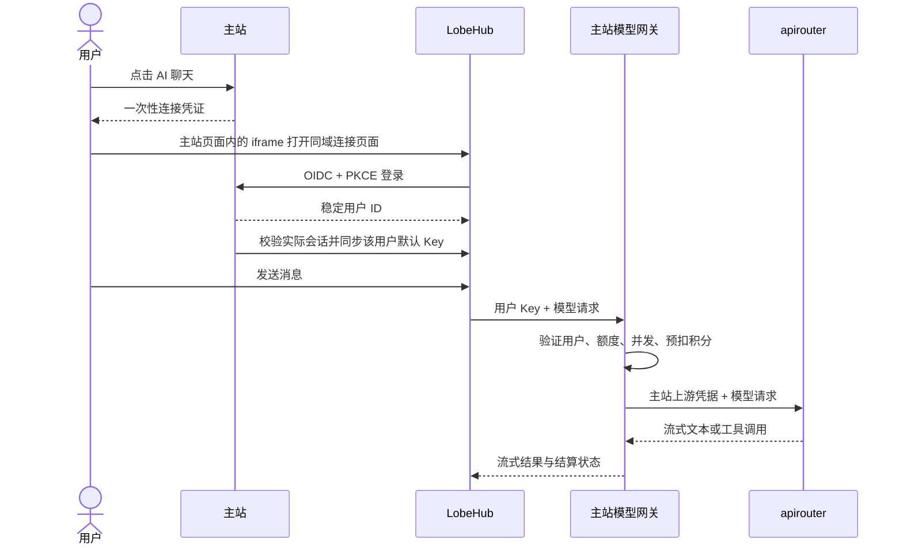

# 主站接入已部署的 LobeHub

适用本次测试环境：主站 `https://test-flowlight.tcmzhan.com`，LobeHub `https://test-lobehub.tcmzhan.com`，apirouter 为主站已经配置的 Relay。这里接入现有 LobeHub，不重建其数据库、对象存储或加密密钥。

本目录的开发工作不会自动修改线上配置。部署顺序为 **apirouter → 主站 → LobeHub 环境变量 → 两个站点的 Nginx 配置**。完成后，用户从主站侧栏「AI 聊天」进入，无需手动复制 Key。

已核实的香港测试服务器可以直接使用 [一键启用脚本](CURRENT-SERVER.md#推荐一键启用)，无需逐项手动编辑下面的配置。脚本只适用于该测试环境的现有目录和服务名称。

## 接入后的链路



- 主站用户 ID 是 OIDC `sub`，数据库保存唯一的主站用户 ↔ LobeHub 用户映射。
- 连接凭证只能使用一次，10 分钟过期；授权码 2 分钟过期，需要 PKCE S256 和客户端密钥。
- 原始用户 Key 由主站后端通过 LobeHub 本机接口写入用户自己的加密 provider 配置。连接 URL、桥接页面和绑定响应都不包含原始 Key。
- 同一主站用户的配置同步使用数据库租约串行执行；多个标签页或多个主站实例同时连接时，后来的请求返回 `SYNC_IN_PROGRESS`，不会让旧同步覆盖刚轮换的 Key。异常中断的同步锁最多 3 分钟自动过期。
- provider 名称为「流光主站」，ID 为 `flowinglight`。每次连接会把其他 provider 全部停用，模型选择器里只留主站模型——LobeHub 自带的 Anthropic、Google 等 provider 默认开着但没有 Key，其模型点了必然失败，也不走主站网关。provider 列表在运行时读取而非写死，随 LobeHub 升级自动适配；个别被官方保护、拒绝停用的 provider 会跳过并记录日志，不影响本次连接。现有聊天记录不受影响。
- 开放模型来自主站后台已启用的文本模型。模型列表展示「模型名称 · 输入/输出 积分/1M Token」，首次绑定设置默认聊天模型和默认助手。
- 本次按 LobeHub v2.2.16 的官方源码接口对接，并对测试服务器当前运行镜像的 provider、模型、用户设置、默认助手接口做了实际验证。升级 LobeHub 后应先在测试环境验证这些接口。

## 1. 发布代码

本次涉及两个仓库，必须一起发布相关改动：

| 仓库 | 改动 |
|---|---|
| `tide-canvas` | OIDC、账号桥接、模型网关、积分记录、主站入口 |
| `apirouter` | Chat Completions 工具参数/结果透传、Responses 转换、异常流结束判断 |

apirouter 中修改 `ChatService.java`、`V1ChatController.java`，新增 `ChatProtocol.java` 及相应测试。附带的 `apirouter-compat.patch` 基于 apirouter 提交 `65ecc41142047491ab196a39a54519984a8961f4`，已通过 `git apply --check`；如果部署来源已经包含这些代码，不要再应用补丁。独立应用前在 apirouter 根目录运行：

```bash
git apply --check /path/to/apirouter-compat.patch
git apply /path/to/apirouter-compat.patch
```

用原有发布流程更新 apirouter、主站后端和前端。主站首次启动会迁移 `lobehub_grant`、`lobehub_link`、`model_gateway_request` 三张新表；原用户和默认 Key 不变。先备份数据库，再按正常发布流程执行迁移。

只部署主站时，保持 `TIDECANVAS_LOBEHUB_SUPPORTSTOOLS=false`，可先接通普通聊天。部署兼容版 apirouter 并确认上游模型支持工具后，再设为 `true`；仅打开开关不能补足上游的工具能力。

## 2. 生成接入密钥和主站配置

将本目录上传到服务器 `/root/lobehub-integration`。Debian 的 Python 依赖可以使用：

```bash
apt-get update
apt-get install -y python3-cryptography
cd /root/lobehub-integration
python3 prepare.py init --supports-tools
```

如果 apirouter 尚未升级，去掉 `--supports-tools`。生成文件全部放在已忽略的 `private/` 中，脚本不打印密钥；重复运行保留已有客户端密钥和 RSA 私钥。生成后自己调整过的 `main.env` 配置会被重新写入默认值，日常部署无需反复运行 `init`。

生成内容：

| 文件 | 用途 |
|---|---|
| `private/client-secret` | OIDC 客户端密钥备份 |
| `private/oidc-private.pem` | 主站 OIDC 签名私钥，必须持久保存 |
| `private/main.env` | 主站后端环境变量 |
| `private/lobehub.env` | 合并进现有 LobeHub 的配置片段 |

`main.override.yml` 为本项目 `deploy/docker-compose.yml` 提供后端 `env_file` 和私钥只读挂载。使用**原有 Compose 项目名、原有主配置文件路径和原有 .env**启动，不要另起一个主站项目。下例的目录应替换成你现有主站部署目录：

```bash
cd /path/to/existing/tidecanvas-deploy
docker compose -f docker-compose.yml -f /root/lobehub-integration/main.override.yml pull
docker compose -f docker-compose.yml -f /root/lobehub-integration/main.override.yml up -d backend frontend
```

以后更新主站时也要保留这个 override，否则会丢失环境变量/私钥挂载。不要运行 `docker compose config` 并把输出贴到公共位置，它可能展开密钥。

当前方案要求主站后端使用 host 网络、LobeHub 映射 `127.0.0.1:3210`。如果你的部署不同，将 `TIDECANVAS_LOBEHUB_INTERNALURL` 改成**主站后端可直达的 LobeHub 内部地址**，不要指向带鉴权子请求的公网反代，以免绑定时发生递归拦截。

检查主站已启用：

```bash
curl -fsS https://test-flowlight.tcmzhan.com/api/lobehub/config
curl -fsS https://test-flowlight.tcmzhan.com/api/lobehub/oidc/.well-known/openid-configuration
curl -fsS https://test-flowlight.tcmzhan.com/api/lobehub/oidc/jwks
```

第一个接口应返回 `enabled: true`。如果为 false，查看主站日志中的 `LobeHub integration is not ready`，检查私钥路径、URL 和客户端密钥。

## 3. 合并 LobeHub 环境变量

先确认现有 LobeHub Compose 工作目录和 `.env` 所在位置。将配置片段合并进去，**不要用片段覆盖整个原文件**：

```bash
python3 /root/lobehub-integration/prepare.py merge-env \
  --target /path/to/existing/lobehub/.env \
  --fragment /root/lobehub-integration/private/lobehub.env
```

脚本自动备份原 `.env`，只替换片段列出的键。保留原 `AUTH_SECRET`、`KEY_VAULTS_SECRET`、`JWKS`、数据库和 S3 配置，这些密钥决定旧账号会话和加密数据能否继续使用。

确认 LobeHub 的 Compose 服务确实通过 `env_file: .env` 或 `environment` 接收下面这些变量。**仅把变量写进用于 Compose 插值的 `.env`，容器不会自动获得它们。**如果当前没有透传，可在现有 `lobehub` 服务下补充：

```yaml
environment:
  AUTH_SSO_PROVIDERS: ${AUTH_SSO_PROVIDERS}
  AUTH_GENERIC_OIDC_ID: ${AUTH_GENERIC_OIDC_ID}
  AUTH_GENERIC_OIDC_SECRET: ${AUTH_GENERIC_OIDC_SECRET}
  AUTH_GENERIC_OIDC_ISSUER: ${AUTH_GENERIC_OIDC_ISSUER}
  AUTH_DISABLE_EMAIL_PASSWORD: ${AUTH_DISABLE_EMAIL_PASSWORD}
  AUTH_ALLOWED_EMAILS: ${AUTH_ALLOWED_EMAILS}
  AUTH_EMAIL_VERIFICATION: ${AUTH_EMAIL_VERIFICATION}
```

随后在现有 LobeHub 目录重新创建该服务，服务名如果不是 `lobehub`，使用实际名称：

```bash
docker compose up -d --force-recreate lobehub
```

无需重启或重建 PostgreSQL、RustFS、SearXNG。保持 `APP_URL=https://test-lobehub.tcmzhan.com`。不要给全部用户配置共享的 `OPENAI_API_KEY`；每个人的主站 Key 由桥接自动写入。

OIDC 回调地址固定允许以下两种版本，不能填写通配符：

- `https://test-lobehub.tcmzhan.com/api/auth/oauth2/callback/generic-oidc`
- `https://test-lobehub.tcmzhan.com/api/auth/callback/generic-oidc`

## 4. 合并 Nginx 路由

在主站的 HTTPS `server` 块引入 `nginx-main-locations.conf`，在 LobeHub 的 HTTPS `server` 块引入 `nginx-lobehub-locations.conf`。可复制文件到 `/etc/nginx/snippets/` 后使用绝对路径 `include`。

保留已有证书、S3 路由、根路径代理和静态资源配置；如果已有相同 `location`，合并内容，不要重复声明。检查更早的正则路由及 `^~ /api/`、`^~ /trpc/` 等规则，避免它们绕过本次鉴权规则。LobeHub 本机 3210 端口不要向公网暴露。

两份片段提供：

- `/flowinglight/connect` 和 `/flowinglight/bind`：LobeHub 同域桥接至主站后端，浏览器正常携带 LobeHub 会话 Cookie。
- OIDC 路径关闭访问日志，避免把授权码等短期凭证写入 Nginx access log。
- 代理显式覆盖客户端 IP 转发头，避免把登录/绑定用户全部统计为 `127.0.0.1`，也不使用请求方伪造的转发链。若前面另有 CDN，应先按该 CDN 的可信地址配置 Nginx real_ip。
- `/api/auth/*` 保留直连 LobeHub，不经过会话子请求。
- LobeHub 的 `/api/*`、`/trpc/*`、`/webapi/*` 业务接口使用 `auth_request` 重新校验主站账号；账号停用后，已有 LobeHub 会话的受保护接口也被拒绝。
- 模型网关保持 SSE 不缓冲，长连接允许 60 分钟；底层模型提供方仍可能有更短的超时。

检查并加载：

```bash
nginx -t
systemctl reload nginx
```

本目录两份片段已用测试服务器的 Nginx 执行独立语法检查，但仍需对你合并后的**完整配置**执行 `nginx -t`。

## 5. 用户使用与计费

用户登录主站 → 侧栏「AI 聊天」→「进入 AI 聊天」，聊天在**主站页面内嵌的 iframe** 里打开，不再跳出到聊天域名。首次进入创建/映射个人 LobeHub 账号、同步模型和默认 Key；后续进入刷新 Key 与开放模型配置。

嵌入依赖两个前提，改域名前先确认：

- 聊天域名与主站域名属于**同一个可注册域**（当前 `test-lobehub.tcmzhan.com` 与 `test-flowlight.tcmzhan.com` 同为 `tcmzhan.com`）。若换成不同注册域，iframe 变成第三方上下文，浏览器会拦截 LobeHub 的会话 Cookie，嵌入将无法登录。
- LobeHub 自身不下发 `X-Frame-Options` / CSP `frame-ancestors`（当前镜像已确认）。桥接页由主站显式允许主站域名作为唯一父页面。

嵌入被浏览器拒绝时，工具条上的「在新标签页打开」仍可用；LobeHub 把丢失的会话弹回主站 `/ai-chat` 时，页面会自动跳出 iframe 回到入口，不会自我嵌套。

| 项目 | 实际规则 |
|---|---|
| 计费方式 | 由**模型自身配置**决定：打开 Token 计费的模型按上游实际返回的 Token 用量结算，非缓存输入 × 输入单价 ÷ 1,000,000 ＋ 缓存输入 × 缓存单价 ÷ 1,000,000 ＋ 输出 × 输出单价 ÷ 1,000,000，向上取整到 0.000001 积分 |
| 单价配置 | **逐个模型**在后台「模型管理 → 文本模型 → AI 聊天 · Token 定价」里设置；开关只作用于当前模型，不影响其他模型 |
| 未配置单价 | 该模型沿用自己的按次积分价格，照常出现在模型列表；没有全站开关，一个模型的定价不影响其他模型 |
| 改价生效 | 计费立即按新单价执行；但模型选择器里的价格标签存在 LobeHub 自己的库里，只在每次连接时推送，所以改价后要在聊天工具条点「同步模型价格」（或退出重进）才会刷新 |
| 单价填错 | 打开了 Token 计费但单价无效的模型会被撤下并拒绝调用，不会悄悄按旧的按次价格收费；后台模型列表的「计费」列显示「Token 单价填写有误」 |
| 预留与释放 | 发起上游请求前按「输入上限 × 输入单价 ＋ 输出上限 × 输出单价」预留积分，结算时释放预留、只扣真实用量。预留期间这部分积分不能被其他功能或订单退款收回 |
| 用量缺失 | 上游未返回可信 usage 时不估算收费：账单置为 `billing_pending`，预留继续保留，等后台在「积分管理 → Token 调用账单」按上游日志核对结算或释放 |
| 重复模型标识 | 同一 `model_key` 存在多条启用记录时，列表、绑定和扣费统一按排序值升序、更新时间降序、ID 升序选择同一条记录 |
| 扣费时机 | 发起上游请求前，事务内校验余额并预留；余额不足不请求上游 |
| 失败 | 上游已报告消耗的输入 Token 照常计费；完全没有用量也没有输出时释放全部预留 |
| 上游异常连接 | 收到明确错误后立即结束并结算，不等待上游主动断开；无效 JSON 事件按中断处理，不转发给页面 |
| 部分结果 | SSE 保留最后一帧中的内容并发送错误；非流式 HTTP 502 的 `partial_response` 字段提供已生成内容，相同请求标识可重放，不重复扣费 |
| 辅助请求 | 工具循环的每次模型调用、翻译、改写等均独立计费；不是一个可见提问永远只收一次 |
| 账单查询 | 用户在「AI 聊天」页查看自己的 Token 账单；管理员在 `/admin/points/token-billing` 查看全部账单并处理待核对项，处理动作写入业务审计日志 |
| 默认辅助设置 | 首次绑定关闭自动标题、推荐、压缩等后台调用，保留主动翻译和改写；用户后续可以自行调整 |
| 每日调用上限 | `TIDECANVAS_LOBEHUB_DAILYLIMIT`，按上海时区，默认 0 不限，统计 pending/success/partial/billing_pending；已释放和未扣费的失败调用不计入 |
| 账户累计上限 | 主站后台用户「API 累计调用额度」，0 不限，正数限制本集成网关累计的 pending/success/partial/billing_pending 次数 |
| 并发 | `TIDECANVAS_LOBEHUB_MAXCONCURRENT`，默认 2；沿用账户并发不限标志 |
| 接口频率 | 每个主站用户、每个网关路由每分钟最多 120 次，超出返回 HTTP 429；不会把所有 LobeHub 用户按同一个出口 IP 合并限流 |
| 历史上下文 | 最近 3 条历史 user/assistant 消息，加当前用户轮次及其工具循环；system/developer 指令单独保留 |
| 幂等重放 | 相同用户提供相同 `Idempotency-Key` 且内容一致时只扣一次；进行中返回 409，完成后可重放。相同键搭配不同内容返回 409 |
| 普通重发 | 未复用请求标识的重新发送、继续提问是新调用，按其自身 Token 用量计费。LobeHub 自身的「重新生成」不承诺免费 |
| 关闭页面 | 已开始的上游调用继续结算；页面断开不代表立即取消。主站崩溃留下的预扣，过期后由后台补偿退款 |
| 补偿异常记录 | 补偿任务按 ID 分页并循环重试，单条退款异常不会阻断后续用户；账号已删除或退款凭证冲突的记录保留并记录日志，供管理员核对 |
| 重置 Key | 主站立即拒绝旧 Key；从主站再次进入 LobeHub，同步最新 Key |
| 账号停用 | 网关即时拒绝，LobeHub 受保护业务接口也通过 Nginx 校验主站状态 |

后台模型调用日志和积分流水会记录归属的主站用户。网关不会复制主站共享上游密钥给 LobeHub，也不会为用户创建 apirouter 后台账号。

工具返回图片/文件时，apirouter 保留 `tool_call_id`、图片精度及文件标识，Responses 通路将它们转换成结构化内容数组，不把整个结果变成 Java 字符串。该形式对应 [OpenAI 官方 SDK 的 FunctionCallOutput 定义](https://github.com/openai/openai-python/blob/main/src/openai/types/responses/response_input_param.py)；具体模型仍需支持所使用的模态。

计费和限额只覆盖 `flowinglight` 的主站网关。**用户自带 Key（BYOK）已被关闭**：每次连接都会停用其他 provider，用户即使手动开启，下次进入也会被再次停用。若日后要放开，去掉绑定流程里的 `hideForeignProviders` 调用即可；那些调用不消耗主站积分。语音、绘图等专用协议接口不由本次文本模型网关提供，需在 LobeHub 配置相应服务；图片输入也取决于主站模型的文件能力配置和上游实际支持。

## 6. 验收与排错

按以下顺序验收，付费模型测试会按后台价格扣积分：

1. 主站登录账户 A，进入 LobeHub，无需再次输入密码；「流光主站」为默认模型服务，可以开始聊天。
2. 使用账户 B 进入，聊天记录和主站 Key 与 A 隔离；两个浏览器更便于测试。相同浏览器切换主站用户时桥接会重新建立正确的 LobeHub 登录。
3. 发起一次短文本，确认返回完整结尾，且主站流水的扣费额等于该次上游返回的 Token 用量按后台单价折算的结果。工具调用使用一个上游已确认支持工具的模型验证。
4. 无积分账户发送请求，网关返回 402。已有任务占满并发时返回 429；日限额/累计额度用完也返回 429。
5. 主站停用该用户，刷新 LobeHub 的业务数据请求应被拒绝；恢复后从主站重新进入。
6. 主站轮换默认 Key，再次进入后可以继续调用；关闭和重启 LobeHub 后聊天记录仍在。

常见现象：

| 现象 | 检查项 |
|---|---|
| 主站显示尚未开放 | 新后端是否已发布、私钥是否挂载、生成配置是否实际进入容器 |
| `统一登录尚未配置` | LobeHub 是否收到 generic-oidc 的四个环境变量、主站 discovery 是否公网可达 |
| 回调失败 | issuer/client ID/client secret 是否两边一致、APP_URL 是否正确、HTTPS 转发头是否保留 |
| 登录成功但同步失败 | INTERNALURL 是否直达 3210、LobeHub RPC 版本是否兼容、主站是否至少开放一个文本模型 |
| 对接后原邮箱账号记录未出现 | 主站 SSO 使用独立映射身份，不自动按邮箱合并旧本地账号；旧记录仍保留在原账号，迁移应另行核验归属 |
| Key 轮换后 401 | 从主站重新进入，等待 Key 同步完成 |
| `SYNC_IN_PROGRESS` | 另一个页面正在同步；稍后从主站重试，进程中断遗留的同步锁最多等待 3 分钟 |
| 回复中断 | 查看模型日志及返回错误；部分输出收费、无有效输出退款；不要仅依据 HTTP 200 判断 SSE 生成成功 |
| 工具不可用 | 先确认 apirouter 兼容改动已发布，再启用 SUPPORTSTOOLS，并确认实际模型支持 function calling |
| 选择器里仍出现其他 provider 的模型 | 该 provider 拒绝被停用（LobeHub 保护的官方 provider），或本次连接读取 provider 列表失败；查后端日志的 `LobeHub kept a provider enabled` / `could not read the LobeHub provider list` |

为了避免将不可信的旧本地账号按邮箱误合并，OIDC 返回稳定的身份别名邮箱，`email_verified=false`。它仅用于账号映射，不是用户收信地址。客户端密钥和 RSA 私钥都应备份；普通更新不要更换它们，也不要更换现有 LobeHub 加密密钥。

## 回滚

先从两个 Nginx server 移除本次新增的 include，检查后 reload。恢复脚本生成的 LobeHub `.env.before-lobehub-*` 备份并重新创建 LobeHub 服务；主站设置 `TIDECANVAS_LOBEHUB_ENABLED=false` 或回滚应用镜像。保留数据库和签名密钥，不删用户、记录、对象存储或积分流水。新主站的补偿任务在集成关闭时也会继续处理已过期预扣。
